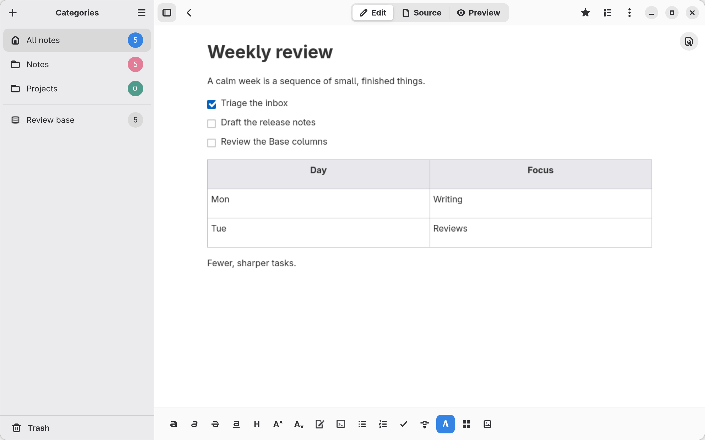

# Carver

[](https://github.com/josbeir/carver/actions/workflows/quality.yml)
[](https://codecov.io/gh/josbeir/carver)
[](LICENSE)
[](https://www.rust-lang.org/)

<p align="center">
  
</p>

A little space for big ideas. Carver is a local-first GNOME note-taking app that stays
out of your way, with the tools you need every day. Quick to open and ready to catch an
idea, it keeps your notes and images on your own computer. Built with Rust and Libadwaita.

**[Explore the website](https://josbeir.github.io/carver/)** ·
[Download Carver](https://github.com/josbeir/carver/releases/latest) ·
[Contribute](CONTRIBUTING.md)

<picture>
  <source media="(prefers-color-scheme: dark)" srcset="docs/src/assets/screenshots/editor-dark.png" />
  
</picture>

## What you can do

- **Write your way.** Switch between rich text, Carve source, and preview. Add images,
  attachments, checklists, and tables; use a split view or clear the distractions to focus.
- **Keep things together.** Organize notes into categories, search your library, and recover
  deleted notes from Trash. Adjust the tools and panels to suit your writing.
- **Give notes structure.** Store text, numbers, booleans, and lists in frontmatter.
  Build saved views called **Bases** with configurable columns, filters, and sort rules,
  and edit property values directly in the table.
- **Keep your notes yours.** Write offline without an account. Import Carve or Markdown;
  export to Carve, Markdown, PDF, or a portable archive with your notes and images.
  [Carve](https://markup-carve.github.io/carve/) source stays readable outside the app.
- **Connect an assistant.** Give Claude Code, Codex, Copilot, or OpenCode useful context
  from your notes through optional local MCP access. Read-only by default, with write
  access explicitly enabled when you want it.

[See Carver in action](https://josbeir.github.io/carver/#screenshots), or explore
[properties and Bases](https://josbeir.github.io/carver/#properties).

## Install

Download the Flatpak bundle and matching `.sha256` file from the
[latest release](https://github.com/josbeir/carver/releases/latest).
If Flatpak asks for Flathub, add it once:

```sh
flatpak remote-add --if-not-exists --user flathub https://dl.flathub.org/repo/flathub.flatpakrepo
```

From the directory containing the download, verify its checksum:

```sh
sha256sum -c carver-*.flatpak.sha256
```

Then install and launch Carver:

```sh
flatpak install --user --or-update --bundle ./carver-*.flatpak
flatpak run io.github.josbeir.Carver
```

Keep only the version you want to install in that directory so the wildcard matches
one bundle and one checksum. Release bundles do not update automatically yet;
download a newer bundle and repeat the install command to update.
Other formats are available on the [releases page](https://github.com/josbeir/carver/releases/latest).

## Agent access

Choose **Connect an agent** in Carver’s menu to copy setup instructions for your client.
The local MCP server opens the same library as your installed app. It is read-only by
default; `--allow-write` enables reversible changes with revision checks.

Connected assistants may send note content to their AI provider.
See the [agent guide](docs/agent-access.md) for supported clients, command-line setup,
and access controls.

## Contributing

For source builds, architecture, tests, translations, and data locations, see
[Contributing to Carver](CONTRIBUTING.md). Website development is covered in
[the site README](docs/README.md).

## License

[MIT](LICENSE).
